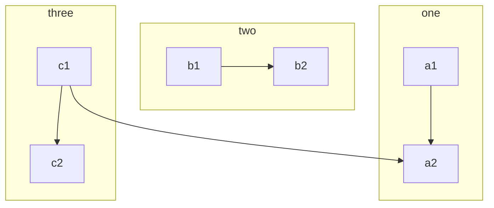
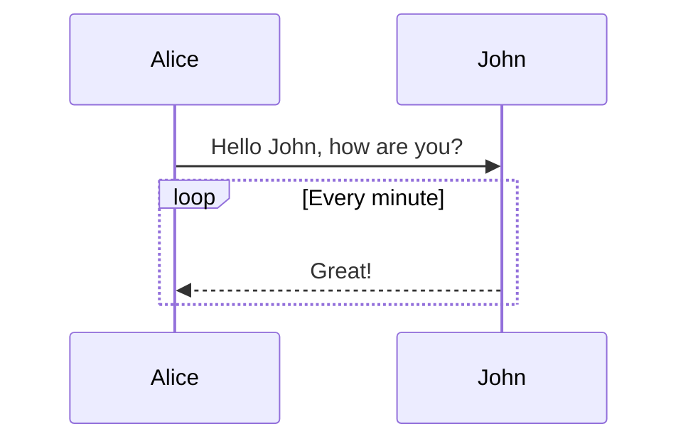
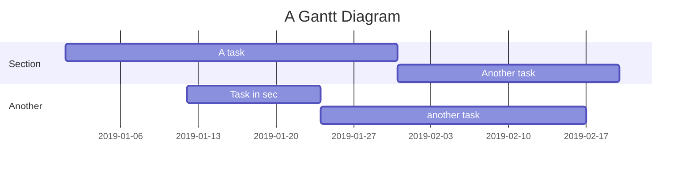
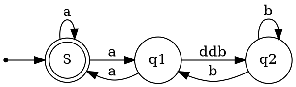

## 가이드

이것은 **Markdown** 타이포그래피를 올바르게 사용하는 방법의 예입니다. 이를 배우면 글을 보다 선명하고 명료하게 작성하는 데 도움이 됩니다.

> 인용 텍스트: 마크 다운은 텍스트 서식 구문에서 영감을 얻은 것입니다.

## 문법 가이드

### 일반 내용

이 컨텐츠는 다음과 같은 컨텐츠의 일부 활자체 형식을 보여줍니다.

- **굵게** - `**굵게**`
- *기울임꼴* - ` *기울임꼴*`
- ~~취소선~~ - ` ~~취소선 ~~`
- `코드 태그` - ` ``코드 태그`` `
- [하이퍼 링크](https://www.google.com "구글") - `[하이퍼 링크](https://www.google.com "구글")`
- [username@gmail.com](mailto:username@gmail.com) - `[username@gmail.com](mailto:username@gmail.com)`

### 멘션 사용자

@Vanessa는 `@User`를 통해 컨텐츠에서 사용자를 언급할 수 있으며 언급된 사용자에게 시스템에 의해 통지됩니다.

> 참고 :
>
> 1. @username 뒤에 공백이 필요합니다
> 2. 초보자에게는 @의 기능 권한이 없습니다.

### 이모티콘

대부분의 표준 이모티콘을 지원합니다. 입력 방법을 사용하여 직접 입력하거나 문자 형식을 수동으로 입력 할 수 있습니다. `:`를 입력하여 자동 완성을 시작하며, 개인 설정에서 [이모티콘 설정](https://github.com/jakekwak/vditor/blob/master/demo/index.js)을 미리 등록 해 놓을 수 있습니다.

#### 일부 표현 예

:smile: :laughing: :dizzy_face: :sob: :cold_sweat: :sweat_smile:  :cry: :triumph: :heart_eyes: :relieved:
:+1: :-1: :100: :clap: :bell: :gift: :question: :bomb: :heart: :coffee: :cyclone: :bow: :kiss: :pray: :anger:

### 제목 3

H1 ~ H6을 사용하도록 선택하고 ##(N)로 시작할 수 있습니다. 게시물 또는 답글의 최상위 제목에는 제목 3을 사용하는 것이 좋습니다. 제목1은 시스템 사이트 수준이고 제목2는 게시물 제목 수준이므로 1 또는 2는 사용하지 마십시오.

> 참고: # 뒤에 공백이 필요하다는 것을 잊지 마십시오!

#### 제목 4

##### 제목 5

###### 제목 6

### 사진

```


```

직접 복사하여 붙여 넣기 및 업로드를 지원합니다.

### 코드 블록

#### 보통

```
*emphasize*   **strong**
_emphasize_   __strong__
var a = 1
```

#### 구문 강조 지원

\``` 다음에 언어 이름을 따르는 경우 다음과 같이 구문 강조 효과가 나타날 수 있습니다.

##### Go 코드 강조

```go
package main

import "fmt"

func main() {
    fmt.Println("Hello, world!")
}
```

##### Java 코드 강조

```java
public class HelloWorld {

    public static void main(String[] args) {
        System.out.println("Hello World!");
    }

}
```

> 팁: 언어 이름은 다음을 지원합니다: `ruby`, `python`, `js`, `html`, `erb`, `css`, `coffee`, `bash`, `json`, `yml`, `xml` ...
> [참조](https://github.com/Vanessa219/vditor/blob/3443d41c91f7dba8cc41614ef8d10394440d10c1/src/ts/constants.ts)

### 순서 없는/순서 있는 목록

#### 순서 없는 목록

- Java
  - Spring
    - IoC
    - AOP
- Go
  - gofmt
  - Wide
- Node.js
  - Koa
  - Express

#### 순서 있는 목록

1. Node.js
   1. Express
   2. Koa
   3. Sails
2. Go
   1. gofmt
   2. Wide
3. Java
   1. Latke
   2. IDEA

#### 체크 박스

- [x] 글쓰기
- [X] 시장 방문하기
- [ ] 치과 의사 예약

### 테이블

데이터 또는 무언가를 표시해야하는 경우 테이블을 사용하도록 선택할 수 있습니다.

| 헤더 1 | 헤더 2 |
| ---- | ---- |
| 셀 1 | 셀 2 |
| 셀 3 | 셀 4 |
| 셀 5 | 셀 6 |

### 세부 사항 숨기기

<details>
<summary> 여기에 요약이 있습니다. </summary>

자세한 내용은 다음과 같습니다.
</details>

### 단락

빈 줄을 사용하면 쉽게 읽을 수 있도록 컨텐츠를 분할 할 수 있습니다. (이것은 첫 번째 단락입니다)

마크 다운 타이포그래피에서 빈 줄을 사용하는 것이 중요합니다. (이것은 두 번째 단락입니다)

### 링크 참조

[링크 텍스트][링크 참조]

[링크 참조]: https://b3log.org

```
[링크 텍스트][링크 참조]

[링크 참조]: https://b3log.org
```

### 수학 공식
> [`KaTeX`](https://katex.org/)인 경우입니다. ([`MathJax`](https://www.mathjax.org/)도 지원합니다.)

여러 줄 수식 블록:

$$
\frac{1}{
  \Bigl(\sqrt{\phi \sqrt{5}}-\phi\Bigr) e^{
  \frac25 \pi}} = 1+\frac{e^{-2\pi}} {1+\frac{e^{-4\pi}} {
    1+\frac{e^{-6\pi}}
    {1+\frac{e^{-8\pi}}{1+\cdots}}
  }
}
$$

인라인 공식:

공식 $a^2 + b^2 = \color{red}c^2$는 인라인입니다.

### 마인드 맵
```mindmap
- 가이드
- 문법 가이드
  - 일반 내용
  - 멘션 사용자
  - 이모티콘 이모지
    - 일부 표현 예
  - 제목 3
    - 제목 4
      - 제목 5
        - 제목 6
  - 사진
  - 코드 블락
    - 보통
    - 구문 강조 지원
      - Go 코드 강조
      - Java 코드 강조
  - 순서 없는/순서 있는 목록
    - 순서 없는 목록
    - 순서 있는 목록
    - 체크 박스
  - 테이블
  - 세부 사항 숨기기
  - 단락
  - 링크 참조
  - 수학 공식
  - 마인드 맵
  - 플로우 차트
  - 타이밍 다이어그램
  - 간트 차트
  - 차트
  - 악보(abcjs)
  - Graphviz
  - 멀티미디어
  - 각주
- 바로가기
```

### 플로우 차트



### 타이밍 다이어그램



### 간트 차트



### 차트

```echarts
{
  "title": { "text": "최근 30일" },
  "tooltip": { "trigger": "axis", "axisPointer": { "lineStyle": { "width": 0 } } },
  "legend": { "data": ["게시물", "사용자", "답장"] },
  "xAxis": [{
      "type": "category",
      "boundaryGap": false,
      "data": ["2019-05-08","2019-05-09","2019-05-10","2019-05-11","2019-05-12","2019-05-13","2019-05-14","2019-05-15","2019-05-16","2019-05-17","2019-05-18","2019-05-19","2019-05-20","2019-05-21","2019-05-22","2019-05-23","2019-05-24","2019-05-25","2019-05-26","2019-05-27","2019-05-28","2019-05-29","2019-05-30","2019-05-31","2019-06-01","2019-06-02","2019-06-03","2019-06-04","2019-06-05","2019-06-06","2019-06-07"],
      "axisTick": { "show": false },
      "axisLine": { "show": false }
  }],
  "yAxis": [{ "type": "value", "axisTick": { "show": false }, "axisLine": { "show": false }, "splitLine": { "lineStyle": { "color": "rgba(0, 0, 0, .38)", "type": "dashed" } } }],
  "series": [
    {
      "name": "게시물", "type": "line", "smooth": true, "itemStyle": { "color": "#d23f31" }, "areaStyle": { "normal": {} }, "z": 3,
      "data": ["18","14","22","9","7","18","10","12","13","16","6","9","15","15","12","15","8","14","9","10","29","22","14","22","9","10","15","9","9","15","0"]
    },
    {
      "name": "사용자", "type": "line", "smooth": true, "itemStyle": { "color": "#f1e05a" }, "areaStyle": { "normal": {} }, "z": 2,
      "data": ["31","33","30","23","16","29","23","37","41","29","16","13","39","23","38","136","89","35","22","50","57","47","36","59","14","23","46","44","51","43","0"]
    },
    {
      "name": "답장", "type": "line", "smooth": true, "itemStyle": { "color": "#4285f4" }, "areaStyle": { "normal": {} }, "z": 1,
      "data": ["35","42","73","15","43","58","55","35","46","87","36","15","44","76","130","73","50","20","21","54","48","73","60","89","26","27","70","63","55","37","0"]
    }
  ]
}
```

### 악보 (abcjs)

```abc
X: 1
T: 서울의 달
M: C
L: 1/8
R: reel
K: Eb
"Cm" z8 | z8 | z ([EG] [E5G5]) | "Gm/Bb" [D8G8] |
"Ab"[E4A4] "Bb"[D4F4] | "Eb"[E4G4] "G7"[D4A4] | "Cm" [G8c8] | "F/A" [F5c5] d2|
"Ab" [A4e4] "G7"[=Bd]f d'2 |"Cm" e'8 | "F/A" f'8 | "Ab"[A4c4e'4] "G7"[G4=Bd'4] |
"Cm" ([G8c8c'8] | [G4c4c'4]) z2 gfed |: cGcG cGcG | "F" cFcF cFcF |
"Ab" cEcE cEcE | "G7"z (d d/2)c/2d/2c/2 d2 g/2f/2e/2d/2 | "Cm" e/2c3/2 ef/2(g/2 g4) | "F" f3/2g/2 f/4g/4f/2e [c2e2] z c/2d/2 |
"Ab" e4 "G7"c/4d3/2 c=B/2(c/2 | "Cm"c)c z/2 d/2e/2d/2 c2 [G2c2] | CGFG C/2GF/2G2|FF FG/2G/2C2 z2 |
w: ~ ~ ~ ~ ~ ~ ~ ~ ~ ~ ~ ~ ~ 서 울 살 이 타 향 살 이 고 달 픈 날 ~ 에
EEEE GG GG/2(G/2| "G7"G/4)(D3/2 D2) z4|"Cm"CGFG C/2GF/2G2|FF FG/2G/2C2 z2|
w: 울 엄 마 가 생 각 이 난 ~ ~ 다 ~ 조 물 조 물 무 쳐 주 신 나 물 반 찬 ~ 에
EEEE GG GG/2G/2|C4 z4|cccB c/2B(c/2 c2)|BB cB/2B/2 G2 z2|
w: 된 장 찌 게 먹 고 싶 구 ~ 나 겁 도 없 이 떠 나 온 ~ 머 나 먼 길 ~ 에
cccB c/2B(c/2 c2)|dd dc/2(d/2 (d4)|d4) z Ged | c2 c3/2c/2 d e3 |
w: 보 고 싶 은 내 고 향 ~ 눈 에 밟 힌 다 ~ ~ 언 젠 가 서 울 에 가 서
c2 c3/2c/2 d e3 | z B/2B/2 Bc dd cd/2d/2 |G4 z Ged | c2 c3/2c/2 d e3 |
w: 성 공 을 해 서 돌 아 온 다 약 속 했 는 ~ 데 세 상 에 울 고 웃 다 가
f/2f/2 fe/2(f/2 f4) |z e/2e/2 ee ff ed/2d/2 | c6 z2 | eeee ffed |
w: 바 쁘 다 보 니 ~ 꿈 에 서 나 갈 수 있 구 나 ~ 서 울 의 달 바 라 보 면
d(c c4) z2 :|
w: 서
```

### Graphviz



### 멀티미디어

**youtube.com**
v.qq.com，youku.com，coub.com，facebook.com/video，dailymotion.com，.mp4，.m4v，.ogg，.ogv，.webm，.mp3，.wav 링크 지원 파싱

https://www.youtube.com/watch?v=S4xoOW4DVKE

### 각주

각주 참조[^1], 다른 각주 참조[^bignote]가 있습니다.
[^1]: 첫 번째 각주 정의.
[^bignote]: 각주 정의는 여러 단락을 사용할 수 있습니다.

    들여 쓰기 및 정렬된 단락이 이 각주 정의에 포함됩니다.
    
    ```
    코드 블록을 사용할 수 있습니다.
    ```

    **굵게** 및 [링크](https://b3log.org)와 같은 다른 줄 수준의 타이포그래피 문법이 있습니다.

```
각주 참조[^1], 다른 각주 참조[^bignote]가 있습니다.
[^1]: 첫 번째 각주 정의.
[^bignote]: 각주 정의는 여러 단락을 사용할 수 있습니다.

    들여 쓰기 및 정렬된 단락이 이 각주 정의에 포함됩니다.
    
    ```
    코드 블록을 사용할 수 있습니다.
    ```

    **굵게** 및 [링크](https://b3log.org)와 같은 다른 줄 수준의 타이포그래피 문법이 있습니다.
```

## 바로 가기

우리 편집기는 많은 단축키를 지원합니다. 자세한 내용은 [키보드 단축키](https://ld246.com/article/1582778815353)를 참조하십시오 (또는 툴바의 "`?`" 누르세요 ?).
